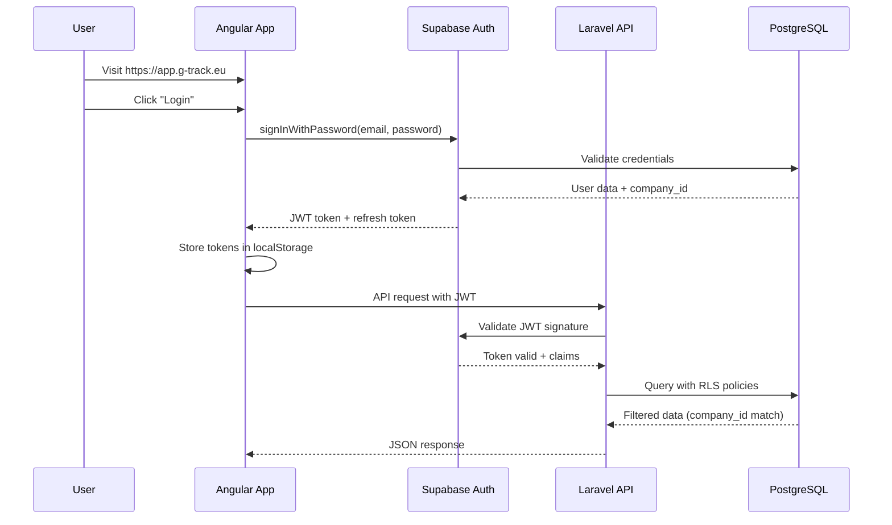

# Authentication & Authorization

## Overview

**Technology:** Supabase Auth (built on GoTrue)

G-Track uses Supabase Auth for identity management and authentication. Supabase Auth provides a production-ready authentication system with JWT tokens, multiple authentication methods, and seamless integration with PostgreSQL Row Level Security (RLS) for authorization.

**Key Features:**
- Built-in email/password authentication
- Magic link (passwordless) authentication
- OAuth providers (Google, Microsoft)
- JWT-based session management
- Automatic token refresh
- Row Level Security (RLS) integration

---

## Authentication Flow



**Authentication Methods:**

1. **Email/Password**
   ```typescript
   const { data, error } = await supabase.auth.signInWithPassword({
     email: 'user@example.com',
     password: 'secure-password'
   });
   ```

2. **Magic Link (Passwordless)**
   ```typescript
   const { data, error } = await supabase.auth.signInWithOtp({
     email: 'user@example.com',
     options: {
       emailRedirectTo: 'https://app.g-track.eu/auth/callback'
     }
   });
   ```

3. **OAuth (Google/Microsoft)**
   ```typescript
   const { data, error } = await supabase.auth.signInWithOAuth({
     provider: 'google',
     options: {
       redirectTo: 'https://app.g-track.eu/auth/callback'
     }
   });
   ```

---

## JWT Token Structure

Supabase Auth issues JWT tokens that contain user identity and custom claims for authorization.

**Token Example:**

```json
{
  "aud": "authenticated",
  "exp": 1730073600,
  "iat": 1730070000,
  "iss": "https://your-project.supabase.co/auth/v1",
  "sub": "a1b2c3d4-e5f6-7890-abcd-ef1234567890",
  "email": "user@example.com",
  "phone": "",
  "app_metadata": {
    "provider": "email",
    "providers": ["email"],
    "company_id": "c5d6e7f8-1234-5678-90ab-cdef12345678"
  },
  "user_metadata": {
    "email": "user@example.com",
    "role": "hr_manager",
    "full_name": "John Smith"
  },
  "role": "authenticated",
  "aal": "aal1",
  "amr": [
    {
      "method": "password",
      "timestamp": 1730070000
    }
  ],
  "session_id": "f1g2h3i4-j5k6-7890-lmno-pqrs12345678"
}
```

**Key Claims:**

| Claim | Description | Example |
|-------|-------------|---------|
| `sub` | User UUID (unique identifier) | `a1b2c3d4-e5f6-7890-abcd-ef1234567890` |
| `email` | User email address | `user@example.com` |
| `role` | Supabase role (always `authenticated` for logged-in users) | `authenticated` |
| `app_metadata.company_id` | Company UUID (multi-tenancy) | `c5d6e7f8-1234-5678-90ab-cdef12345678` |
| `user_metadata.role` | G-Track application role | `hr_manager`, `dispatcher`, `driver` |
| `exp` | Token expiration (Unix timestamp) | `1730073600` |

**Token Validation:**

- **Frontend:** Supabase JS client handles token storage and refresh automatically
- **Backend:** Laravel validates JWT using Supabase project's public key (RS256 algorithm)

---

## RBAC with Row Level Security

G-Track implements Role-Based Access Control (RBAC) using PostgreSQL Row Level Security (RLS) policies. Authorization logic is enforced at the database level, ensuring security even if application code has bugs.

### 5 Application Roles

| Role | Scope | Key Permissions |
|------|-------|-----------------|
| **Admin** | Full system | Everything (superuser access) |
| **Accountant** | Financial | Invoices, payments, financial reports, driver salaries |
| **HR Manager** | People | Drivers, documents, comments, hiring/firing |
| **Dispatcher** | Operations | Orders, transport units, assignments, readiness view |
| **Driver** | Self-service | Own profile, own documents, assigned orders |

**Role stored in:** `users.role` column (enum: `admin`, `accountant`, `hr_manager`, `dispatcher`, `driver`)

### Row Level Security Policies

RLS policies automatically filter data based on JWT claims extracted from the authenticated session.

**Example Policy: Drivers Table**

```sql
-- Policy: Users can only see drivers from their own company
CREATE POLICY "company_isolation_select"
ON drivers FOR SELECT
USING (
  company_id = (
    SELECT (auth.jwt() -> 'app_metadata' ->> 'company_id')::uuid
  )
);

-- Policy: Only HR Managers and Admins can insert drivers
CREATE POLICY "hr_can_insert_drivers"
ON drivers FOR INSERT
WITH CHECK (
  company_id = (SELECT (auth.jwt() -> 'app_metadata' ->> 'company_id')::uuid)
  AND
  (SELECT (auth.jwt() -> 'user_metadata' ->> 'role')) IN ('admin', 'hr_manager')
);

-- Policy: Drivers can update only their own profile
CREATE POLICY "drivers_update_self"
ON drivers FOR UPDATE
USING (
  id = (SELECT (auth.jwt() ->> 'sub')::uuid)
  AND
  (SELECT (auth.jwt() -> 'user_metadata' ->> 'role')) = 'driver'
);
```

**How It Works:**

1. User authenticates → Receives JWT with `company_id` and `role`
2. Frontend makes API request → Passes JWT in `Authorization: Bearer <token>` header
3. Backend validates JWT → Extracts claims
4. Backend queries database → PostgreSQL applies RLS policies
5. Database returns **only rows matching policies** (company_id + role permissions)

**Benefits:**

- Security enforced at database level (cannot be bypassed)
- Zero-trust architecture (even compromised backend cannot access other companies' data)
- Simplified application code (no need for `WHERE company_id = ?` in every query)
- Audit trail (RLS policies are version-controlled and tested)

---

## Permission Matrix

Detailed permissions for each role across key features.

### Drivers Module

| Action | Admin | Accountant | HR Manager | Dispatcher | Driver |
|--------|-------|------------|------------|------------|--------|
| View all drivers | ✅ | ✅ | ✅ | ✅ | ❌ |
| View own profile | ✅ | ✅ | ✅ | ✅ | ✅ |
| Create new driver | ✅ | ❌ | ✅ | ❌ | ❌ |
| Edit driver profile | ✅ | ❌ | ✅ | ❌ | ✅ (self only) |
| Delete driver | ✅ | ❌ | ✅ | ❌ | ❌ |
| Manage documents | ✅ | ❌ | ✅ | ❌ | ✅ (self only) |
| View salary | ✅ | ✅ | ❌ | ❌ | ✅ (self only) |

### Documents Module

| Action | Admin | Accountant | HR Manager | Dispatcher | Driver |
|--------|-------|------------|------------|------------|--------|
| View all documents | ✅ | ❌ | ✅ | ⚠️ (limited) | ❌ |
| View own documents | ✅ | ✅ | ✅ | ✅ | ✅ |
| Upload document | ✅ | ❌ | ✅ | ❌ | ✅ (self only) |
| Delete document | ✅ | ❌ | ✅ | ❌ | ❌ |
| Verify document | ✅ | ❌ | ✅ | ❌ | ❌ |
| Receive expiry alerts | ✅ | ❌ | ✅ | ✅ | ✅ (self only) |

⚠️ Dispatcher sees only documents relevant to orders (e.g., CMR, delivery notes)

### Finance Module

| Action | Admin | Accountant | HR Manager | Dispatcher | Driver |
|--------|-------|------------|------------|------------|--------|
| View driver salaries | ✅ | ✅ | ❌ | ❌ | ✅ (self only) |
| Edit salary details | ✅ | ✅ | ❌ | ❌ | ❌ |
| Create invoices | ✅ | ✅ | ❌ | ❌ | ❌ |
| View invoices | ✅ | ✅ | ❌ | ❌ | ❌ |
| Process payments | ✅ | ✅ | ❌ | ❌ | ❌ |
| Generate reports | ✅ | ✅ | ❌ | ❌ | ❌ |

### Orders Module

| Action | Admin | Accountant | HR Manager | Dispatcher | Driver |
|--------|-------|------------|------------|------------|--------|
| View all orders | ✅ | ✅ | ❌ | ✅ | ❌ |
| View assigned orders | ✅ | ✅ | ❌ | ✅ | ✅ |
| Create order | ✅ | ❌ | ❌ | ✅ | ❌ |
| Assign driver | ✅ | ❌ | ❌ | ✅ | ❌ |
| Update status | ✅ | ❌ | ❌ | ✅ | ✅ (assigned only) |
| Delete order | ✅ | ❌ | ❌ | ✅ | ❌ |
| View route/map | ✅ | ✅ | ❌ | ✅ | ✅ (assigned only) |

---

## Multi-Tenancy Security

G-Track uses **company_id-based multi-tenancy** with PostgreSQL Row Level Security (RLS) to ensure complete data isolation between companies.

### Architecture

```
Company A (UUID: aaa-111)          Company B (UUID: bbb-222)
├── drivers (company_id: aaa-111)  ├── drivers (company_id: bbb-222)
├── orders (company_id: aaa-111)   ├── orders (company_id: bbb-222)
└── documents (company_id: aaa-111)└── documents (company_id: bbb-222)
                    ↓
            PostgreSQL Database
                    ↓
        RLS Policies (automatic filtering)
                    ↓
        Users CANNOT see other companies' data
```

### Implementation

**1. Database Schema:**

Every multi-tenant table has a `company_id` column:

```sql
CREATE TABLE drivers (
  id UUID PRIMARY KEY DEFAULT gen_random_uuid(),
  company_id UUID NOT NULL REFERENCES companies(id) ON DELETE CASCADE,
  email VARCHAR(255) NOT NULL,
  first_name VARCHAR(100) NOT NULL,
  -- ... other columns
  created_at TIMESTAMPTZ DEFAULT now(),
  updated_at TIMESTAMPTZ DEFAULT now()
);

-- Index for fast company_id filtering
CREATE INDEX idx_drivers_company_id ON drivers(company_id);
```

**2. RLS Policy (Company Isolation):**

```sql
-- Enable RLS on table
ALTER TABLE drivers ENABLE ROW LEVEL SECURITY;

-- Policy: Users see only their company's data
CREATE POLICY "company_isolation"
ON drivers
FOR ALL
USING (
  company_id = (
    SELECT (auth.jwt() -> 'app_metadata' ->> 'company_id')::uuid
  )
);
```

**3. User Registration:**

When a new user signs up:
1. Create company record → Get `company_id`
2. Create user in Supabase Auth
3. Set `app_metadata.company_id` in user profile
4. All subsequent queries automatically filter by this `company_id`

**4. JWT Token:**

```json
{
  "sub": "user-uuid",
  "app_metadata": {
    "company_id": "c5d6e7f8-1234-5678-90ab-cdef12345678"
  }
}
```

**5. Query Example:**

```sql
-- User queries all drivers
SELECT * FROM drivers;

-- PostgreSQL automatically rewrites to:
SELECT * FROM drivers
WHERE company_id = 'c5d6e7f8-1234-5678-90ab-cdef12345678';
```

### Security Guarantees

✅ **Database-level isolation** (cannot be bypassed by application bugs)
✅ **Zero manual filtering** (no `WHERE company_id = ?` in queries)
✅ **Automatic for all queries** (SELECT, INSERT, UPDATE, DELETE)
✅ **Performance optimized** (indexed company_id columns)
✅ **Audit compliant** (all access logged with company_id)

---

## Code Examples

### Frontend (Angular 20 + Supabase JS)

**1. Initialize Supabase Client**

```typescript
// src/app/core/services/supabase.service.ts
import { Injectable } from '@angular/core';
import { createClient, SupabaseClient } from '@supabase/supabase-js';
import { environment } from '@env/environment';

@Injectable({
  providedIn: 'root'
})
export class SupabaseService {
  private supabase: SupabaseClient;

  constructor() {
    this.supabase = createClient(
      environment.supabaseUrl,
      environment.supabaseAnonKey
    );
  }

  get client() {
    return this.supabase;
  }

  get auth() {
    return this.supabase.auth;
  }
}
```

**2. Login Component**

```typescript
// src/app/auth/login/login.component.ts
import { Component } from '@angular/core';
import { Router } from '@angular/router';
import { SupabaseService } from '@core/services/supabase.service';

@Component({
  selector: 'app-login',
  templateUrl: './login.component.html'
})
export class LoginComponent {
  email = '';
  password = '';
  loading = false;
  error: string | null = null;

  constructor(
    private supabase: SupabaseService,
    private router: Router
  ) {}

  async login() {
    this.loading = true;
    this.error = null;

    const { data, error } = await this.supabase.auth.signInWithPassword({
      email: this.email,
      password: this.password
    });

    if (error) {
      this.error = error.message;
      this.loading = false;
      return;
    }

    // Redirect to dashboard
    this.router.navigate(['/dashboard']);
  }

  async loginWithGoogle() {
    const { data, error } = await this.supabase.auth.signInWithOAuth({
      provider: 'google',
      options: {
        redirectTo: `${window.location.origin}/auth/callback`
      }
    });

    if (error) {
      this.error = error.message;
    }
  }
}
```

**3. Auth Guard**

```typescript
// src/app/core/guards/auth.guard.ts
import { Injectable } from '@angular/core';
import { Router, CanActivate } from '@angular/router';
import { SupabaseService } from '@core/services/supabase.service';

@Injectable({
  providedIn: 'root'
})
export class AuthGuard implements CanActivate {
  constructor(
    private supabase: SupabaseService,
    private router: Router
  ) {}

  async canActivate(): Promise<boolean> {
    const { data: { session } } = await this.supabase.auth.getSession();

    if (!session) {
      this.router.navigate(['/login']);
      return false;
    }

    return true;
  }
}
```

**4. HTTP Interceptor (Attach JWT)**

```typescript
// src/app/core/interceptors/auth.interceptor.ts
import { Injectable } from '@angular/core';
import { HttpInterceptor, HttpRequest, HttpHandler } from '@angular/common/http';
import { SupabaseService } from '@core/services/supabase.service';
import { from, switchMap } from 'rxjs';

@Injectable()
export class AuthInterceptor implements HttpInterceptor {
  constructor(private supabase: SupabaseService) {}

  intercept(req: HttpRequest<any>, next: HttpHandler) {
    return from(this.supabase.auth.getSession()).pipe(
      switchMap(({ data: { session } }) => {
        if (session?.access_token) {
          req = req.clone({
            setHeaders: {
              Authorization: `Bearer ${session.access_token}`
            }
          });
        }
        return next.handle(req);
      })
    );
  }
}
```

### Backend (Laravel 12 + Supabase JWT)

**1. Supabase Auth Configuration**

```php
// config/supabase.php
<?php

return [
    'url' => env('SUPABASE_URL'),
    'anon_key' => env('SUPABASE_ANON_KEY'),
    'service_role_key' => env('SUPABASE_SERVICE_ROLE_KEY'),
    'jwt_secret' => env('SUPABASE_JWT_SECRET'),
];
```

**.env**

```
SUPABASE_URL=https://your-project.supabase.co
SUPABASE_ANON_KEY=eyJhbGc...
SUPABASE_SERVICE_ROLE_KEY=eyJhbGc...
SUPABASE_JWT_SECRET=your-jwt-secret
```

**2. JWT Validation Middleware**

```php
// app/Http/Middleware/SupabaseAuth.php
<?php

namespace App\Http\Middleware;

use Closure;
use Firebase\JWT\JWT;
use Firebase\JWT\Key;
use Illuminate\Http\Request;

class SupabaseAuth
{
    public function handle(Request $request, Closure $next)
    {
        $token = $request->bearerToken();

        if (!$token) {
            return response()->json(['error' => 'Unauthorized'], 401);
        }

        try {
            $decoded = JWT::decode(
                $token,
                new Key(config('supabase.jwt_secret'), 'HS256')
            );

            // Attach user info to request
            $request->merge([
                'user_id' => $decoded->sub,
                'company_id' => $decoded->app_metadata->company_id ?? null,
                'role' => $decoded->user_metadata->role ?? 'driver',
                'email' => $decoded->email,
            ]);

            // Set PostgreSQL session variables for RLS
            DB::statement("SET app.user_id = ?", [$decoded->sub]);
            DB::statement("SET app.company_id = ?", [$decoded->app_metadata->company_id]);
            DB::statement("SET app.user_role = ?", [$decoded->user_metadata->role]);

        } catch (\Exception $e) {
            return response()->json(['error' => 'Invalid token'], 401);
        }

        return $next($request);
    }
}
```

**3. Register Middleware**

```php
// bootstrap/app.php (Laravel 12)
use App\Http\Middleware\SupabaseAuth;

return Application::configure(basePath: dirname(__DIR__))
    ->withRouting(
        web: __DIR__.'/../routes/web.php',
        api: __DIR__.'/../routes/api.php',
        commands: __DIR__.'/../routes/console.php',
    )
    ->withMiddleware(function (Middleware $middleware) {
        $middleware->alias([
            'supabase.auth' => SupabaseAuth::class,
        ]);
    })
    ->create();
```

**4. Protected Route Example**

```php
// routes/api.php
use App\Http\Controllers\DriverController;

Route::middleware(['supabase.auth'])->group(function () {
    // GET /api/drivers - RLS automatically filters by company_id
    Route::get('/drivers', [DriverController::class, 'index']);

    // POST /api/drivers - RLS checks role permissions
    Route::post('/drivers', [DriverController::class, 'store']);

    // GET /api/drivers/{id} - RLS checks company_id match
    Route::get('/drivers/{id}', [DriverController::class, 'show']);
});
```

**5. Controller Example (No Manual Filtering)**

```php
// app/Http/Controllers/DriverController.php
<?php

namespace App\Http\Controllers;

use App\Models\Driver;
use Illuminate\Http\Request;

class DriverController extends Controller
{
    public function index(Request $request)
    {
        // RLS automatically filters by company_id
        // No need for: ->where('company_id', $request->company_id)
        $drivers = Driver::with(['documents', 'vehicle'])
            ->orderBy('created_at', 'desc')
            ->paginate(20);

        return response()->json($drivers);
    }

    public function store(Request $request)
    {
        $validated = $request->validate([
            'email' => 'required|email|unique:drivers',
            'first_name' => 'required|string|max:100',
            'last_name' => 'required|string|max:100',
            'phone' => 'required|string|max:20',
        ]);

        // RLS automatically sets company_id and checks permissions
        $driver = Driver::create([
            ...$validated,
            'company_id' => $request->company_id, // From JWT
        ]);

        return response()->json($driver, 201);
    }
}
```

**6. Database Connection with RLS**

```php
// config/database.php
'pgsql' => [
    'driver' => 'pgsql',
    'url' => env('DATABASE_URL'),
    'host' => env('DB_HOST', '127.0.0.1'),
    'port' => env('DB_PORT', '5432'),
    'database' => env('DB_DATABASE', 'forge'),
    'username' => env('DB_USERNAME', 'forge'),
    'password' => env('DB_PASSWORD', ''),
    'charset' => 'utf8',
    'prefix' => '',
    'prefix_indexes' => true,
    'search_path' => 'public',
    'sslmode' => 'prefer',
    'options' => [
        // Enable RLS for all connections
        PDO::ATTR_EMULATE_PREPARES => false,
    ],
],
```

---

## Session Management

**Access Token Lifetime:** 1 hour
**Refresh Token Lifetime:** 30 days
**Auto-refresh:** Handled by Supabase JS client

**Frontend Token Refresh:**

```typescript
// Supabase client automatically refreshes tokens
// No manual code needed!

// To manually refresh:
const { data, error } = await supabase.auth.refreshSession();
```

**Logout:**

```typescript
// Frontend
await supabase.auth.signOut();

// Backend - Laravel
// No action needed (stateless JWT)
```

---

## Security Best Practices

### Frontend

✅ **Store tokens securely** (localStorage with httpOnly flag if possible)
✅ **Use HTTPS only** (enforced in production)
✅ **Validate token before making API calls**
✅ **Handle token expiry gracefully** (redirect to login)
✅ **Never expose Supabase service role key** (use anon key only)

### Backend

✅ **Always validate JWT signature** (never trust client-provided data)
✅ **Use RLS policies for ALL tables** (defense in depth)
✅ **Set PostgreSQL session variables** (for RLS context)
✅ **Rate limit authentication endpoints** (prevent brute force)
✅ **Log all authentication events** (audit trail)

### Database

✅ **Enable RLS on all multi-tenant tables**
✅ **Test RLS policies with different roles**
✅ **Use `SECURITY DEFINER` functions carefully** (can bypass RLS)
✅ **Index `company_id` columns** (performance)
✅ **Regularly audit RLS policies** (security review)

---

## Testing Authentication

### Frontend Tests (Jasmine/Karma)

```typescript
// src/app/auth/login/login.component.spec.ts
import { TestBed } from '@angular/core/testing';
import { LoginComponent } from './login.component';
import { SupabaseService } from '@core/services/supabase.service';

describe('LoginComponent', () => {
  let component: LoginComponent;
  let supabaseService: jasmine.SpyObj<SupabaseService>;

  beforeEach(() => {
    const spy = jasmine.createSpyObj('SupabaseService', ['auth']);

    TestBed.configureTestingModule({
      declarations: [LoginComponent],
      providers: [
        { provide: SupabaseService, useValue: spy }
      ]
    });

    component = TestBed.createComponent(LoginComponent).componentInstance;
    supabaseService = TestBed.inject(SupabaseService) as jasmine.SpyObj<SupabaseService>;
  });

  it('should call signInWithPassword on login', async () => {
    supabaseService.auth.signInWithPassword.and.returnValue(
      Promise.resolve({ data: { session: {} }, error: null })
    );

    component.email = 'test@example.com';
    component.password = 'password123';
    await component.login();

    expect(supabaseService.auth.signInWithPassword).toHaveBeenCalledWith({
      email: 'test@example.com',
      password: 'password123'
    });
  });
});
```

### Backend Tests (Pest)

```php
// tests/Feature/Auth/DriverAccessTest.php
<?php

use App\Models\Driver;
use App\Models\Company;
use Firebase\JWT\JWT;

test('user can only see drivers from own company', function () {
    $companyA = Company::factory()->create();
    $companyB = Company::factory()->create();

    Driver::factory()->count(3)->create(['company_id' => $companyA->id]);
    Driver::factory()->count(2)->create(['company_id' => $companyB->id]);

    $token = generateTestToken(['company_id' => $companyA->id]);

    $response = $this->withToken($token)
        ->getJson('/api/drivers');

    $response->assertStatus(200)
        ->assertJsonCount(3, 'data'); // Only 3 from Company A
});

test('hr manager can create drivers', function () {
    $company = Company::factory()->create();
    $token = generateTestToken([
        'company_id' => $company->id,
        'role' => 'hr_manager'
    ]);

    $response = $this->withToken($token)
        ->postJson('/api/drivers', [
            'email' => 'newdriver@example.com',
            'first_name' => 'John',
            'last_name' => 'Doe',
            'phone' => '+1234567890'
        ]);

    $response->assertStatus(201);
});

test('driver cannot create drivers', function () {
    $company = Company::factory()->create();
    $token = generateTestToken([
        'company_id' => $company->id,
        'role' => 'driver'
    ]);

    $response = $this->withToken($token)
        ->postJson('/api/drivers', [
            'email' => 'newdriver@example.com',
            'first_name' => 'John',
            'last_name' => 'Doe',
            'phone' => '+1234567890'
        ]);

    $response->assertStatus(403); // RLS policy blocks
});

// Helper function
function generateTestToken(array $claims): string
{
    $payload = [
        'sub' => 'test-user-uuid',
        'email' => 'test@example.com',
        'role' => 'authenticated',
        'app_metadata' => [
            'company_id' => $claims['company_id'],
        ],
        'user_metadata' => [
            'role' => $claims['role'] ?? 'driver',
        ],
        'exp' => time() + 3600,
    ];

    return JWT::encode($payload, config('supabase.jwt_secret'), 'HS256');
}
```

---

## Troubleshooting

### Common Issues

**1. 401 Unauthorized**

```
Error: Invalid token
```

**Solution:** Check JWT signature validation. Ensure `SUPABASE_JWT_SECRET` matches your Supabase project.

```bash
# Get JWT secret from Supabase Dashboard:
# Settings → API → JWT Secret
```

---

**2. RLS Policy Blocks Query**

```
Error: new row violates row-level security policy
```

**Solution:** Check that `company_id` in JWT matches the row's `company_id`. Verify RLS policy conditions.

```sql
-- Debug RLS policies
SELECT * FROM pg_policies WHERE tablename = 'drivers';

-- Test as specific user
SET ROLE authenticated;
SET app.company_id = 'c5d6e7f8-1234-5678-90ab-cdef12345678';
SELECT * FROM drivers; -- Should work
```

---

**3. Token Expired**

```
Error: Token has expired
```

**Solution:** Implement automatic token refresh in frontend.

```typescript
// Supabase client handles this automatically
// Or manually refresh:
const { data, error } = await supabase.auth.refreshSession();
```

---

**4. Missing company_id in JWT**

```
Error: Cannot extract company_id from token
```

**Solution:** Ensure `company_id` is set in `app_metadata` during user creation.

```typescript
// During signup:
const { data, error } = await supabase.auth.signUp({
  email: 'user@example.com',
  password: 'password',
  options: {
    data: {
      company_id: 'c5d6e7f8-1234-5678-90ab-cdef12345678'
    }
  }
});
```

---

## References

- [Supabase Auth Documentation](https://supabase.com/docs/guides/auth)
- [Row Level Security (RLS) Guide](https://supabase.com/docs/guides/auth/row-level-security)
- [Supabase JS Client](https://supabase.com/docs/reference/javascript/auth-signinwithpassword)
- [PostgreSQL RLS Policies](https://www.postgresql.org/docs/current/ddl-rowsecurity.html)
- [JWT.io - Token Debugger](https://jwt.io/)

---

**Last Updated:** November 12, 2025
**Version:** 3.0.0 (Supabase Auth Migration)
**Migration Date:** November 2025 (Auth0 → Supabase)
