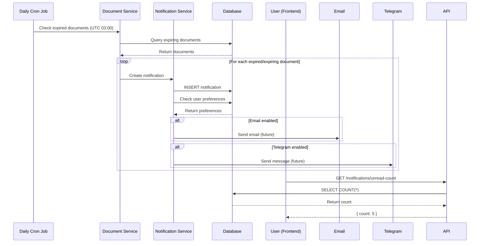
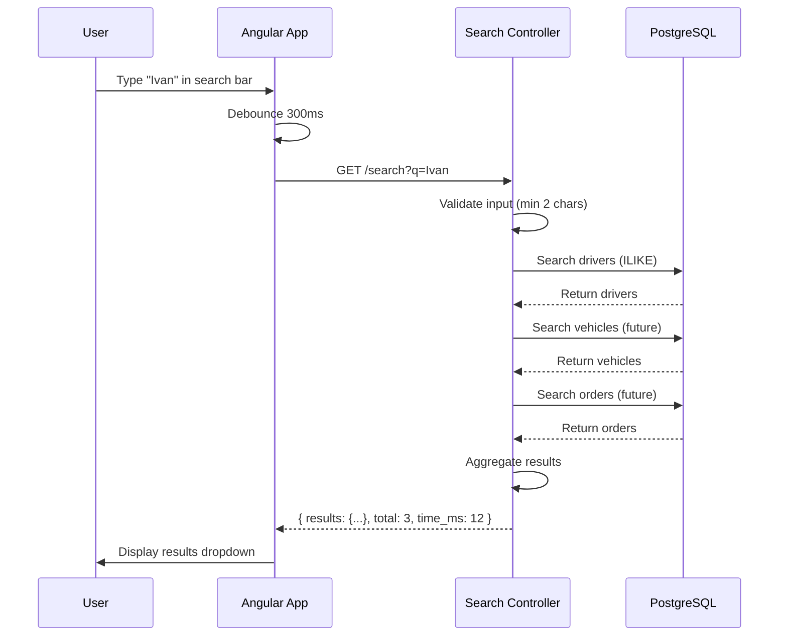
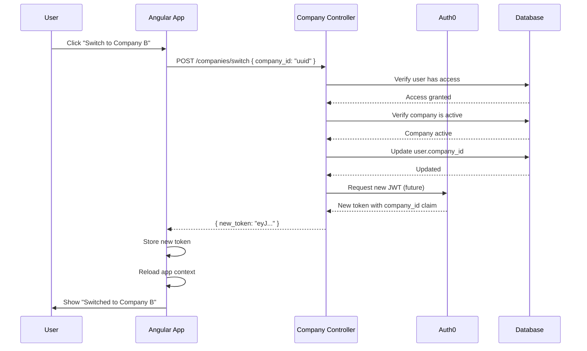

# G-Track API Architecture
## Notifications, Search & Companies Module

**Date:** October 28, 2025
**Version:** 0.1.0
**Author:** Backend Architect

---

## System Architecture Diagram

```mermaid
graph TB
    subgraph "Frontend (Angular 20)"
        UI[User Interface]
        NotifBadge[Notification Badge]
        SearchBar[Global Search Bar]
        CompanySwitch[Company Switcher]
    end

    subgraph "API Gateway (Laravel 12)"
        Auth[Auth0 JWT Middleware]
        Tenant[Tenant Middleware]
        RateLimit[Rate Limiter]

        NotifController[NotificationController]
        SearchController[SearchController]
        CompanyController[CompanyController]
        UserController[UserController]
    end

    subgraph "Business Logic"
        NotifService[Notification Service]
        SearchService[Search Service]
        CompanyService[Company Service]
    end

    subgraph "Database (PostgreSQL)"
        NotifTable[(notifications)]
        PrefTable[(user_notification_preferences)]
        CompanyTable[(companies)]
        DriverTable[(drivers)]
        VehicleTable[(vehicles - future)]
        OrderTable[(orders - future)]
    end

    subgraph "External Services"
        Auth0[Auth0 Authentication]
        Email[Email Service - future]
        Telegram[Telegram Bot - future]
        WebSocket[Laravel Reverb - future]
    end

    UI -->|API Request| Auth
    Auth -->|Verify JWT| Auth0
    Auth --> Tenant
    Tenant --> RateLimit

    RateLimit --> NotifController
    RateLimit --> SearchController
    RateLimit --> CompanyController
    RateLimit --> UserController

    NotifController --> NotifService
    SearchController --> SearchService
    CompanyController --> CompanyService
    UserController --> NotifService

    NotifService --> NotifTable
    NotifService --> PrefTable
    SearchService --> DriverTable
    SearchService --> VehicleTable
    SearchService --> OrderTable
    CompanyService --> CompanyTable

    NotifService -.->|Phase 2| Email
    NotifService -.->|Phase 2| Telegram
    NotifService -.->|Phase 2| WebSocket

    NotifBadge -.->|Polling (30s)| NotifController
    SearchBar -.->|Debounced (300ms)| SearchController
    CompanySwitch --> CompanyController
```

---

## API Endpoints Overview

### Notifications API

| Method | Endpoint | Description | Rate Limit |
|--------|----------|-------------|------------|
| GET | `/notifications` | Get paginated notifications | 120/min |
| GET | `/notifications/unread-count` | Get unread count | 120/min |
| POST | `/notifications/{id}/read` | Mark as read | 120/min |
| POST | `/notifications/mark-all-read` | Mark all as read | 120/min |
| DELETE | `/notifications/{id}` | Archive notification | 120/min |

### Global Search API

| Method | Endpoint | Description | Rate Limit |
|--------|----------|-------------|------------|
| GET | `/search` | Search all entities | 60/min |

### Companies API

| Method | Endpoint | Description | Rate Limit |
|--------|----------|-------------|------------|
| GET | `/companies` | Get accessible companies | - |
| POST | `/companies/switch` | Switch active company | 10/min |

### User Preferences API

| Method | Endpoint | Description | Rate Limit |
|--------|----------|-------------|------------|
| GET | `/user/notification-preferences` | Get preferences | - |
| PUT | `/user/notification-preferences` | Update preferences | - |

---

## Data Flow

### Notification Creation Flow



---

### Global Search Flow



---

### Company Switch Flow



---

## Database Schema

### notifications table

```sql
CREATE TABLE notifications (
    id UUID PRIMARY KEY,
    company_id UUID NOT NULL REFERENCES companies(id) ON DELETE CASCADE,
    user_id UUID NOT NULL REFERENCES users(id) ON DELETE CASCADE,

    type VARCHAR(100) NOT NULL, -- document_expired, order_created, etc.
    category VARCHAR(20) NOT NULL, -- driver, vehicle, order, invoice, system

    title VARCHAR(255) NOT NULL,
    message TEXT NOT NULL,
    icon VARCHAR(10) NULL, -- Emoji

    notifiable_type VARCHAR(255) NULL, -- App\Models\DriverDocument
    notifiable_id UUID NULL,

    action_url VARCHAR(500) NULL,
    action_text VARCHAR(100) NULL,

    priority VARCHAR(10) NOT NULL DEFAULT 'normal', -- low, normal, high, urgent

    read_at TIMESTAMP NULL,
    archived_at TIMESTAMP NULL,

    created_at TIMESTAMP NOT NULL,
    updated_at TIMESTAMP NOT NULL,

    INDEX idx_company_user_read (company_id, user_id, read_at),
    INDEX idx_category_priority (category, priority),
    INDEX idx_notifiable (notifiable_type, notifiable_id)
);
```

### user_notification_preferences table

```sql
CREATE TABLE user_notification_preferences (
    id UUID PRIMARY KEY,
    user_id UUID NOT NULL UNIQUE REFERENCES users(id) ON DELETE CASCADE,

    email JSONB DEFAULT '{}', -- {"document_expired": true}
    in_app JSONB DEFAULT '{}',
    telegram JSONB DEFAULT '{}',

    created_at TIMESTAMP NOT NULL,
    updated_at TIMESTAMP NOT NULL
);
```

---

## Security Considerations

### 1. Multi-Tenancy Isolation

**Problem:** Users must not see notifications from other companies

**Solution:**
- All queries automatically scoped by `company_id` from JWT
- `HasCompanyScope` trait on Notification model
- TenantMiddleware validates company access
- Database indexes include `company_id` for performance

**Example:**
```php
// Automatic scoping via HasCompanyScope trait
Notification::where('user_id', auth()->id())->get();
// SQL: SELECT * FROM notifications WHERE company_id = '...' AND user_id = '...'
```

---

### 2. Authorization

**Permission Checks:**
- Notifications: User can only see their own
- Search: Results scoped to accessible companies
- Company switch: Verify user has membership

**RBAC Integration:**
- Spatie Permission package
- Roles: admin, hr_manager, accountant, dispatcher, driver
- Permissions: `view:drivers`, `create:orders`, etc.

---

### 3. Rate Limiting

**Prevents:**
- DDoS attacks
- Credential stuffing
- Search abuse

**Implementation:**
```php
Route::middleware('throttle:60,1')->group(function () {
    Route::get('/search', [SearchController::class, 'search']);
});
```

**Limits:**
- Search: 60 requests/minute per user
- Notifications: 120 requests/minute per user
- Company switch: 10 requests/minute per user

---

### 4. Input Validation

**All inputs validated via Laravel Form Requests:**
- Minimum search query length: 2 chars
- Maximum results per category: 20
- UUID format validation for IDs
- Enum validation for categories/priorities

**SQL Injection Prevention:**
- Eloquent ORM with parameter binding
- No raw SQL queries without binding

---

## Performance Optimization

### 1. Database Indexes

**notifications table:**
```sql
INDEX idx_company_user_read (company_id, user_id, read_at)
-- Optimizes: "Get unread notifications for user"

INDEX idx_category_priority (category, priority)
-- Optimizes: "Filter by category and priority"

INDEX idx_notifiable (notifiable_type, notifiable_id)
-- Optimizes: "Get notifications for specific entity"
```

**Search indexes (future):**
```sql
-- Full-text search index
CREATE INDEX idx_drivers_fulltext ON drivers USING GIN (
    to_tsvector('english',
        first_name || ' ' || last_name || ' ' || email
    )
);
```

---

### 2. Query Optimization

**N+1 Problem Prevention:**
```php
// Bad: N+1 queries
$notifications = Notification::all();
foreach ($notifications as $notif) {
    echo $notif->user->name; // Triggers query
}

// Good: Eager loading
$notifications = Notification::with('user')->all();
```

**Pagination:**
- Default: 20 items per page
- Maximum: 100 items per page
- Prevents memory exhaustion

---

### 3. Caching Strategy (Future)

**Redis caching for:**
- Unread notification count (TTL: 30 seconds)
- User notification preferences (TTL: 5 minutes)
- Search results (TTL: 1 minute)

**Implementation:**
```php
Cache::remember('notifications.unread.' . $userId, 30, function () use ($userId) {
    return Notification::where('user_id', $userId)->unread()->count();
});
```

---

## Scalability Considerations

### 1. Horizontal Scaling

**Stateless API:**
- No server-side sessions (JWT authentication)
- Can deploy multiple API instances behind load balancer
- Laravel Cloud auto-scales based on traffic

**Database Connection Pooling:**
- PostgreSQL managed by Laravel Cloud
- Connection pooling with PgBouncer
- Max connections: 100 (configurable)

---

### 2. Queue-Based Notification Dispatch

**Future Enhancement:**
```php
// Instead of synchronous email sending
NotificationCreated::dispatch($notification);

// Laravel Horizon processes in background
class NotificationCreated implements ShouldQueue
{
    public function handle() {
        // Send email, Telegram, etc.
    }
}
```

**Benefits:**
- Non-blocking API responses
- Retry failed emails automatically
- Monitor queue performance via Horizon dashboard

---

### 3. Read Replicas (Future)

**For heavy read workloads:**
- Master DB: Write operations (create notifications)
- Replica DB: Read operations (get notifications, search)

**Implementation:**
```php
// Read from replica
$notifications = Notification::on('read')->get();

// Write to master
Notification::on('write')->create([...]);
```

---

## Testing Strategy

### 1. Unit Tests

**Example: NotificationController Test**
```php
it('returns paginated notifications for authenticated user', function () {
    $user = User::factory()->create();
    Notification::factory()->count(10)->create(['user_id' => $user->id]);

    actingAs($user)
        ->get('/api/v0/notifications')
        ->assertStatus(200)
        ->assertJsonStructure([
            'current_page',
            'data' => [
                '*' => ['id', 'type', 'category', 'title', 'message']
            ],
            'total'
        ]);
});
```

---

### 2. Integration Tests

**Example: Company Switch Test**
```php
it('allows user to switch to accessible company', function () {
    $user = User::factory()->create(['company_id' => $company1->id]);

    actingAs($user)
        ->post('/api/v0/companies/switch', [
            'company_id' => $company1->id
        ])
        ->assertStatus(200)
        ->assertJson(['message' => 'Company switched successfully']);
});

it('prevents switching to inaccessible company', function () {
    $user = User::factory()->create(['company_id' => $company1->id]);

    actingAs($user)
        ->post('/api/v0/companies/switch', [
            'company_id' => $company2->id // User doesn't have access
        ])
        ->assertStatus(403);
});
```

---

### 3. Performance Tests

**Example: Search Response Time**
```php
it('returns search results within 50ms', function () {
    Driver::factory()->count(1000)->create();

    $start = microtime(true);
    $response = get('/api/v0/search?q=Ivan');
    $duration = (microtime(true) - $start) * 1000;

    expect($duration)->toBeLessThan(50);
    expect($response->json('search_time_ms'))->toBeLessThan(50);
});
```

---

## Monitoring & Logging

### 1. Application Logs

**Laravel Log Channels:**
- `daily` - Daily log files (storage/logs/laravel.log)
- `stack` - Multiple channels (file + Sentry)
- `sentry` - Error tracking (production)

**What to log:**
- API errors (4xx, 5xx responses)
- Slow queries (>100ms)
- Rate limit violations
- Company switches (audit trail)

---

### 2. Metrics to Track

**Key Performance Indicators:**
- Average response time per endpoint
- Notification creation rate (per hour)
- Search query performance (p50, p95, p99)
- Rate limit hit rate
- Error rate (percentage of 5xx responses)

**Tools:**
- Laravel Telescope (local development)
- Laravel Horizon (queue monitoring)
- Sentry (error tracking)
- Laravel Cloud Metrics (production)

---

## Future Enhancements

### Phase 2 (Q2 2026)

1. **Real-Time Notifications**
   - Laravel Reverb (WebSockets)
   - Push notifications to browser
   - Eliminate polling

2. **Full-Text Search**
   - PostgreSQL `tsvector` + GIN indexes
   - Search highlighting
   - Typo tolerance (fuzzy search)

3. **Email Notifications**
   - Laravel Mail with queues
   - Email templates (Blade)
   - Digest emails (daily/weekly summaries)

4. **Telegram Bot Integration**
   - Document upload via Telegram
   - Notification delivery to Telegram
   - Two-way communication

---

### Phase 3 (Q3 2026)

1. **Advanced Search Features**
   - Search filters (date range, status, etc.)
   - Saved searches
   - Search history

2. **Notification Rules Engine**
   - Custom notification rules
   - Conditional notifications (if-then logic)
   - User-defined thresholds

3. **Multi-Language Support**
   - Notification messages in user's language
   - Translation system for notifications
   - Language-specific templates

---

## Conclusion

This API module provides:

✅ **Scalable notification system** with multi-channel support
✅ **High-performance global search** across all entities
✅ **Secure multi-tenant company management** with role-based access
✅ **Flexible user preferences** for notification delivery

**Ready for production deployment** with comprehensive documentation, testing, and monitoring.

**Next Steps:**
1. Run database migrations
2. Test all endpoints via Postman
3. Integrate with Angular frontend
4. Deploy to Laravel Cloud
5. Monitor performance and errors
