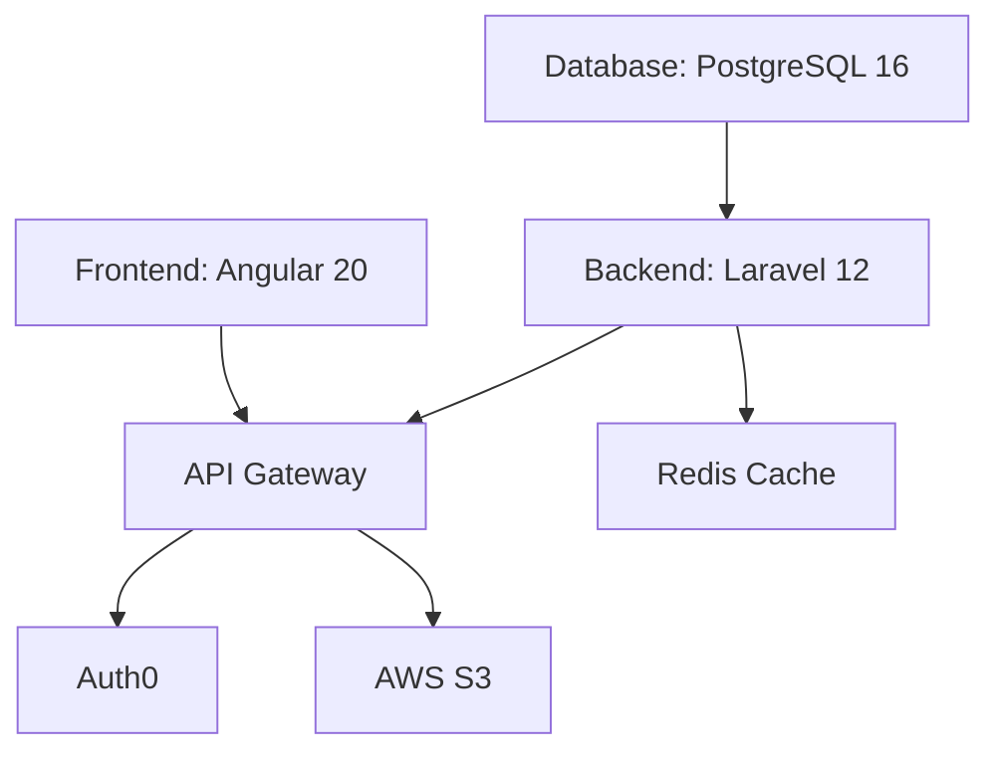
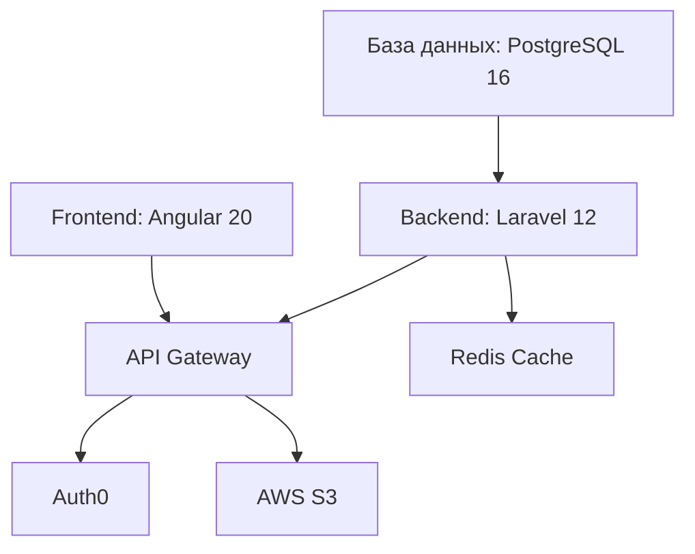

# Welcome to G-Track TMS Documentation | Добро пожаловать в документацию G-Track TMS

---

## 🇬🇧 English

### About G-Track

**G-Track** is a modern Software-as-a-Service (SaaS) Transport Management System designed specifically for small-to-medium logistics companies (2-50 vehicles) operating across the European Union.

The platform addresses critical pain points in:
- 📄 **Driver document management** - Automated expiration tracking for 14 document types
- 🚚 **Vehicle & trailer management** - Technical inspection and service tracking
- 📦 **Order processing** - Complete transport order lifecycle
- 💰 **Financial operations** - EU VAT compliant invoicing and payments
- 🌍 **Multi-country operations** - 5 languages, multi-currency support

### Current Development Status

**Phase:** MVP (Minimum Viable Product)
**Timeline:** Q4 2025 - Q1 2026
**Target Launch:** January 2026

**Priority #1:** Drivers Module (90% → 100% complete)

### Quick Navigation

=== "System Foundation"

    - [Executive Summary](01-executive-summary.md) - Project overview and key features
    - [Project Overview](02-project-overview.md) - Business context and problem statement
    - [Technology Stack](03-technology-stack.md) - Angular 20, Laravel 12, PostgreSQL 16+
    - [System Architecture](04-system-architecture.md) - Multi-tenancy, authentication, authorization
    - [Authentication](05-authentication.md) - Auth0 integration and RBAC
    - [Onboarding](06-onboarding.md) - Company setup and first-time user experience

=== "Core Modules"

    - [Drivers Module](07-drivers-module/index.md) - **Priority #1** (90% complete)
        - Document management for 14 types
        - Readiness tracking and alerts
        - Mobile document upload via Telegram Bot
    - [Vehicles Module](08-vehicles-module.md) - Trucks and trailers management *(placeholder)*
    - [Customers Module](09-customers-module.md) - Customer and carrier companies *(placeholder)*
    - [Orders Module](10-orders-module.md) - Transport order lifecycle *(placeholder)*
    - [Invoices Module](11-invoices-module.md) - EU VAT compliant invoicing *(placeholder)*

=== "Technical Reference"

    - [Financial System](12-financial-system.md) - Pricing, subscriptions, billing
    - [Internationalization](13-i18n.md) - Multi-language support (RU, EN, CZ, PL, DE)
    - [Database Schema](14-database-schema.md) - PostgreSQL structure and relationships
    - [API Specification](15-api-specification.md) - RESTful API endpoints

=== "Project Management"

    - [Roadmap](16-roadmap.md) - Development phases, milestones, timeline

### Technology Stack

**Frontend:** Angular 20 + TypeScript 5.6 + Material Design 3
**Backend:** Laravel 12 + PHP 8.3 + RESTful API
**Database:** PostgreSQL 16 + PostGIS + TimescaleDB
**Hosting:** Vercel (frontend) + Laravel Cloud (backend)

### Key Features

✅ **Multi-tenant Architecture** - Company → Offices → Users isolation
✅ **Document Expiration Tracking** - Automated alerts for 14 document types
✅ **Readiness Dashboard** - Real-time view of which drivers can work today
✅ **Mobile-First Design** - PWA support for document upload on mobile devices
✅ **EU VAT Compliance** - Domestic, Reverse Charge, Non-VAT invoice modes
✅ **5 Languages** - Russian, English, Czech, Polish, German
✅ **RBAC** - 5 roles (Admin, Accountant, HR Manager, Dispatcher, Driver)

---

## 🇷🇺 Русский

### О G-Track

**G-Track** — это современная Software-as-a-Service (SaaS) система управления транспортом, разработанная специально для малых и средних логистических компаний (2-50 транспортных средств), работающих в Европейском Союзе.

Платформа решает критические проблемы в:
- 📄 **Управлении документами водителей** - Автоматическое отслеживание сроков действия 14 типов документов
- 🚚 **Управлении транспортом и прицепами** - Отслеживание техосмотров и обслуживания
- 📦 **Обработке заказов** - Полный жизненный цикл транспортных заказов
- 💰 **Финансовых операциях** - Выставление счетов с соблюдением НДС ЕС
- 🌍 **Международных операциях** - 5 языков, поддержка нескольких валют

### Текущий статус разработки

**Фаза:** MVP (Минимальный жизнеспособный продукт)
**Сроки:** Q4 2025 - Q1 2026
**Планируемый запуск:** Январь 2026

**Приоритет #1:** Модуль водителей (90% → 100% готовности)

### Быстрая навигация

=== "Основы системы"

    - [Краткое изложение](01-executive-summary.md) - Обзор проекта и ключевые функции
    - [Обзор проекта](02-project-overview.md) - Бизнес-контекст и постановка проблемы
    - [Технологический стек](03-technology-stack.md) - Angular 20, Laravel 12, PostgreSQL 16+
    - [Архитектура системы](04-system-architecture.md) - Мультитенантность, аутентификация, авторизация
    - [Аутентификация](05-authentication.md) - Интеграция Auth0 и RBAC
    - [Онбординг](06-onboarding.md) - Настройка компании и опыт первого пользователя

=== "Основные модули"

    - [Модуль водителей](07-drivers-module/index.md) - **Приоритет #1** (90% готовности)
        - Управление документами 14 типов
        - Отслеживание готовности и уведомления
        - Загрузка документов через Telegram Bot
    - [Модуль транспорта](08-vehicles-module.md) - Управление грузовиками и прицепами *(заглушка)*
    - [Модуль клиентов](09-customers-module.md) - Компании-клиенты и перевозчики *(заглушка)*
    - [Модуль заказов](10-orders-module.md) - Жизненный цикл транспортных заказов *(заглушка)*
    - [Модуль счетов](11-invoices-module.md) - Выставление счетов с НДС ЕС *(заглушка)*

=== "Техническая справка"

    - [Финансовая система](12-financial-system.md) - Цены, подписки, выставление счетов
    - [Интернационализация](13-i18n.md) - Поддержка языков (RU, EN, CZ, PL, DE)
    - [Схема базы данных](14-database-schema.md) - Структура PostgreSQL и связи
    - [API спецификация](15-api-specification.md) - RESTful API endpoints

=== "Управление проектом"

    - [Дорожная карта](16-roadmap.md) - Фазы разработки, вехи, сроки

### Технологический стек

**Frontend:** Angular 20 + TypeScript 5.6 + Material Design 3
**Backend:** Laravel 12 + PHP 8.3 + RESTful API
**База данных:** PostgreSQL 16 + PostGIS + TimescaleDB
**Хостинг:** Vercel (frontend) + Laravel Cloud (backend)

### Ключевые функции

✅ **Мультитенантная архитектура** - Изоляция: Компания → Офисы → Пользователи
✅ **Отслеживание сроков документов** - Автоматические уведомления для 14 типов документов
✅ **Панель готовности** - Актуальный статус: какие водители могут работать сегодня
✅ **Мобильный дизайн** - PWA поддержка для загрузки документов с мобильных устройств
✅ **Соответствие НДС ЕС** - Внутренние, Reverse Charge, безНДС режимы счетов
✅ **5 языков** - Русский, Английский, Чешский, Польский, Немецкий
✅ **RBAC** - 5 ролей (Администратор, Бухгалтер, HR Менеджер, Диспетчер, Водитель)

---

## 📖 Documentation Version | Версия документации

**Version:** 2.0.0 (Bilingual Restructure)
**Last Updated:** October 29, 2025
**Based on:** Master Specification v3.1 (October 27, 2025)

**Source Repository:** [github.com/tqlismqn/gtrack-docs](https://github.com/tqlismqn/gtrack-docs) *(Private)*

---

## 🚀 Quick Start | Быстрый старт

=== "For Developers | Для разработчиков"

    1. Read [System Architecture](04-system-architecture.md) to understand the technical foundation
    2. Review [Drivers Module](07-drivers-module/index.md) as the reference implementation
    3. Check [API Specification](15-api-specification.md) for backend integration
    4. See [Database Schema](14-database-schema.md) for data model

=== "For Product Managers | Для продакт-менеджеров"

    1. Start with [Executive Summary](01-executive-summary.md) for high-level overview
    2. Read [Project Overview](02-project-overview.md) for business context
    3. Review [Roadmap](16-roadmap.md) for development timeline
    4. Check [Drivers Module - Business Logic](07-drivers-module/business-logic.md) for feature details

=== "For UI/UX Designers | Для UI/UX дизайнеров"

    1. Review [Drivers Module - UI/UX](07-drivers-module/ui-ux.md) for design patterns
    2. Check [Internationalization](13-i18n.md) for multi-language support
    3. See [Onboarding](06-onboarding.md) for user flow

---

**Need help? | Нужна помощь?**

Contact the development team via Linear or GitHub Issues.
