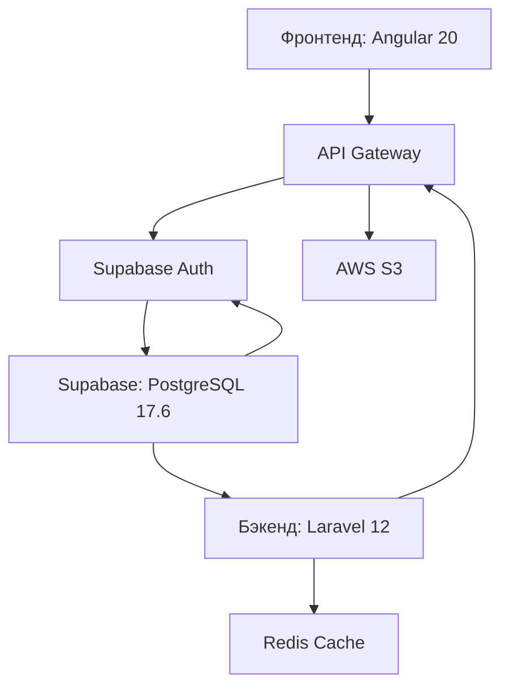

# Добро пожаловать в документацию G-Track TMS

**G-Track** — современная Software-as-a-Service (SaaS) система управления транспортом, разработанная специально для малых и средних логистических компаний (2-50 транспортных единиц), работающих в Европейском Союзе.

---

## О системе G-Track

Платформа решает критические проблемы в:

- 📄 **Управление документами водителей** - Автоматическое отслеживание сроков действия 14 типов документов
- 🚚 **Управление транспортом и прицепами** - Отслеживание техосмотров и сервисного обслуживания
- 📦 **Обработка заказов** - Полный жизненный цикл транспортных заказов
- 💰 **Финансовые операции** - Выставление счетов с соблюдением НДС ЕС и платежи
- 🌍 **Международные операции** - 5 языков, поддержка множества валют

---

## Текущий статус разработки

**Фаза:** MVP (Minimum Viable Product)
**Сроки:** Q4 2025 - Q1 2026
**Целевой запуск:** Январь 2026

**Приоритет #1:** Модуль водителей (95% завершено)

---

## Быстрая навигация

=== "Системная основа"

    - [Краткое описание](01-executive-summary.md) - Обзор проекта и ключевые функции
    - [Обзор проекта](02-project-overview.md) - Бизнес-контекст и постановка задачи
    - [Технологический стек](03-technology-stack.md) - Angular 20, Laravel 12, Supabase
    - [Архитектура системы](04-system-architecture.md) - Мультитенантность, аутентификация, авторизация
    - [Аутентификация](05-authentication.md) - Интеграция Supabase Auth и RBAC на основе RLS
    - [Онбординг](06-onboarding.md) - Настройка компании и первый опыт пользователя

=== "Основные модули"

    - [Модуль водителей](07-drivers-module/index.md) - **Приоритет #1** (95% завершено)
        - Управление документами для 14 типов
        - Отслеживание готовности и уведомления
        - Загрузка документов через Telegram Bot
    - [Модуль транспорта](08-vehicles-module.md) - Управление грузовиками и прицепами *(заглушка)*
    - [Модуль клиентов](09-customers-module.md) - Клиенты и компании-перевозчики *(заглушка)*
    - [Модуль заказов](10-orders-module.md) - Жизненный цикл транспортных заказов *(заглушка)*
    - [Модуль счетов](11-invoices-module.md) - Выставление счетов с соблюдением НДС ЕС *(заглушка)*

=== "Техническая документация"

    - [Финансовая система](12-financial-system.md) - Ценообразование, подписки, биллинг
    - [Интернационализация](13-i18n.md) - Поддержка нескольких языков (RU, EN, CZ, PL, DE)
    - [Схема базы данных](14-database-schema.md) - Структура PostgreSQL и связи
    - [API спецификация](15-api-specification.md) - RESTful API endpoints

=== "Управление проектом"

    - [Дорожная карта](16-roadmap.md) - Фазы разработки, вехи, временные рамки

---

## Технологический стек

**Фронтенд:** Angular 20 + TypeScript 5.6 + Taiga UI 4.60.0
**Бэкенд:** Laravel 12 + PHP 8.3 + RESTful API
**База данных:** Supabase PostgreSQL 17.6 + PostGIS + TimescaleDB
**Аутентификация:** Supabase Auth (JWT + RLS)
**Хостинг:** Vercel (фронтенд) + Laravel Cloud (бэкенд) + Supabase (база данных)

---

## Ключевые функции

✅ **Мультитенантная архитектура** - Изоляция: Компания → Офисы → Пользователи
✅ **Отслеживание сроков документов** - Автоматические уведомления для 14 типов документов
✅ **Дашборд готовности** - В реальном времени показывает, какие водители могут работать сегодня
✅ **Mobile-First дизайн** - PWA поддержка для загрузки документов с мобильных устройств
✅ **Соблюдение НДС ЕС** - Режимы счетов: Внутренний, Reverse Charge, Без НДС
✅ **5 языков** - Русский, Английский, Чешский, Польский, Немецкий
✅ **RBAC** - 5 ролей (Администратор, Бухгалтер, HR менеджер, Диспетчер, Водитель)

---

## 📖 Версия документации

**Версия:** 2.2.0 (только английский + базовый русский)
**Последнее обновление:** 12 ноября 2025
**Основа:** Master Specification v3.1 + Обновления ноября 2025

**Репозиторий:** [github.com/tqlismqn/gtrack-docs](https://github.com/tqlismqn/gtrack-docs) *(Приватный)*

---

## 🎯 Быстрая проверка статуса

**Хотите увидеть текущий статус проекта?** Проверьте [**PROJECT_STATUS.md**](PROJECT_STATUS.md):
- ✅ Прогресс текущего спринта (Неделя 2: 11-17 ноября 2025)
- 🔄 Что сейчас в работе
- 📋 Недавние изменения (последние 2 недели)
- 🎯 Следующие вехи

**Для полной истории проекта:** Смотрите [**CHANGELOG.md**](CHANGELOG.md)

---

## 🚀 Быстрый старт

=== "Для разработчиков"

    1. Прочитайте [Архитектура системы](04-system-architecture.md) для понимания технической основы
    2. Изучите [Модуль водителей](07-drivers-module/index.md) как референсную реализацию
    3. Проверьте [API спецификацию](15-api-specification.md) для интеграции с бэкендом
    4. Смотрите [Схему базы данных](14-database-schema.md) для модели данных

=== "Для менеджеров продукта"

    1. Начните с [Краткого описания](01-executive-summary.md) для общего понимания
    2. Прочитайте [Обзор проекта](02-project-overview.md) для бизнес-контекста
    3. Изучите [Дорожную карту](16-roadmap.md) для временной шкалы разработки
    4. Проверьте [Модуль водителей - Бизнес-логика](07-drivers-module/business-logic.md) для деталей функций

=== "Для UI/UX дизайнеров"

    1. Изучите [Модуль водителей - UI/UX](07-drivers-module/ui-ux.md) для паттернов дизайна
    2. Проверьте [Интернационализацию](13-i18n.md) для поддержки нескольких языков
    3. Смотрите [Онбординг](06-onboarding.md) для пользовательского flow

---

**Нужна помощь?**

Свяжитесь с командой разработки через Linear или GitHub Issues.
